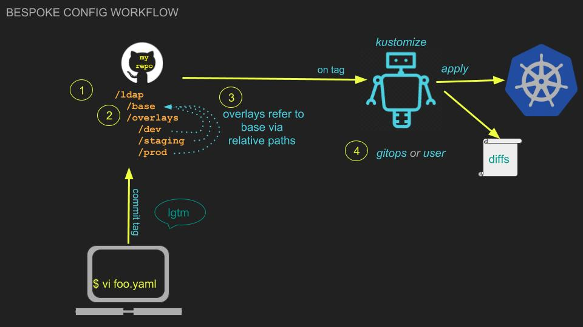

# Deployment

deploying with **Kustomize**

Why Kustomize?

- Natively built into kubectl
- Purely declarative approach to configuration customization
- Kustomize encourages a fork/modify/rebase workflow
- Manage an arbitrary number of distinctly customized Kubernetes configurations
- Setting cross-cutting fields - e.g. namespace, labels, annotations, name-prefixes, etc

## Prerequisite

```bash
brew install kubernetes-cli
# make sure you v3.2.0 or above
brew install kustomize
# optional
brew install skaffold
brew install kubernetes-helm
```

> Generate `.dockerconfigjson` for imagePullSecrets from **GitHub Docker Registry**

```bash
kubectl create secret docker-registry regcred \
--docker-server=<your-registry-server> \
--docker-username=<user | org> \
--docker-password=<password | token> \
--docker-email=<email> \
-o 'go-template={{index .data ".dockerconfigjson"}}' --dry-run | base64 --decode > deploy/overlays/production/secrets/.dockerconfigjson

# example
export GITHUB_DOCKER_READ_PASSWORD=15650cad4e8a6602284255f7caf76134eb977b45

kubectl create secret docker-registry regcred \
--docker-server=https://docker.pkg.github.com \
--docker-username=xmlking \
--docker-password=$GITHUB_DOCKER_READ_PASSWORD \
--docker-email=xmlking@gmail.com \
-o 'go-template={{index .data ".dockerconfigjson"}}' --dry-run | base64 --decode > deploy/overlays/production/secrets/.dockerconfigjson
```

## Workflows

A _workflow_ is the sequence of steps one takes to use and maintain a configuration.



## Matrix Deployment

Typical release process includes deploying multiple related components to multiple environments/profiles <br/>
_kustomize_ matrix layout helps organizing kubernetes manifest files, reducing duplication <br/>
and apply consistence labels, environment specific overlays

|      | account-µs (r,sr,k) | emailer-µs (r,sr,k) | account-api (r,sr,k) | gateway (r,sr,k) |
| ---- | :-----------------: | :-----------------: | :------------------: | :--------------: |
| Dev  |       (p,c,k)       |       (p,c,k)       |        (p,k)         |       (k)        |
| Test |      (p,c,s,k)      |      (p,c,s,k)      |      (p,c,s,k)       |      (p,k)       |
| Prod |     (r,p,c,s,k)     |      (p,c,s,k)      |      (p,c,s,k)       |     (p,i,k)      |

### Legend

| symbol | description   |
| ------ | ------------- |
| r      | Resources     |
| sr     | Service       |
| i      | Ingress       |
| c      | ConfigMap     |
| s      | Secret        |
| p      | Patches       |
| k      | Kustomization |

### Layout for Matrix Deployment

> single component layout

```
├── base
│   ├── deployment.yaml
│   ├── kustomization.yaml
│   └── service.yaml
└── overlays
    ├── dev
    │   ├── kustomization.yaml
    │   └── patch.yaml
    ├── prod
    │   ├── kustomization.yaml
    │   └── patch.yaml
    └── staging
        ├── kustomization.yaml
      └── patch.yaml
```

> multi component layout

```
deploy
├── bases <-- components
│   ├── account-api
│   │   ├── deployment.yaml
│   │   ├── kustomization.yaml
│   │   └── service.yaml
│   ├── account-srv
│   │   ├── deployment.yaml
│   │   ├── kustomization.yaml
│   │   └── service.yaml
│   ├── config
│   │   └── config.yaml
│   ├── emailer-srv
│   │   ├── deployment.yaml
│   │   ├── kustomization.yaml
│   │   └── service.yaml
│   ├── gateway
│   │   ├── deployment.yaml
│   │   ├── kustomization.yaml
│   │   └── service.yaml
│   ├── kustomization.yaml
│   └──  micro-service-account.yaml
├── kustomization.yaml
└── overlays <-- environments
    ├── dev
    │   ├── config
    │   │   └── config.yaml
    │   └── kustomization.yaml
    ├── production
    │   ├── config
    │   │   └── config.yaml
    │   ├── kustomization.yaml
    │   ├── patches
    │   │   ├── replica_count.yaml
    │   │   └── resource_limit.yaml
    │   └── resources
    │       ├── hpa.yaml
    │       └── namespace.yaml
    └── staging
        ├── config
        │   └── config.yaml
        ├── config.env
        ├── deployment.yaml
        └── kustomization.yaml
```

## Kustomize

```bash

# Kustomize command the modified manifests can be generated and printed to the terminal with: --load_restrictions none
# for e2e env
kubectl kustomize ./deploy/overlays/e2e
# only production env
kubectl kustomize ./deploy/overlays/production

# using `sed` to further customize output
OVERLAY="e2e" NS="default"; kustomize build deploy/overlays/${OVERLAY}/ | \
sed -e "s|\$(NS)|${NS}|g" -e "s|\$(IMAGE_VERSION)|${VERSION}|g" > release.yaml

# The manifests can be applied
kubectl apply -k ./deploy/overlays/production

# update image version
IMAGE_VERSION=v0.1.0-118-g21f8a30
cd deploy && kustomize edit set image xmlking/account-srv:$IMAGE_VERSION && cd ..

kustomize build deploy/overlays/staging | kubectl apply -f -
kustomize build deploy/overlays/production | kubectl apply -f -

# Fix the missing and deprecated fields in kustomization file
kustomize edit fix

kustomize build deploy/overlays/production

kubectl get -k deploy/overlays/production
kubectl describe -k deploy/overlays/production
kubectl delete -k deploy/overlays/production
```

## verify

```bash
# highlight `microhq/micro:latest`
kustomize build ./deploy/overlays/production | grep -C 3 microhq/micro:latest
# Validate kustomize build
kustomize build ./deploy/overlays/production | kubeval --strict --ignore-missing-schemas

# compare the output directly to see how consul and production differ:
diff \
  <(kustomize build ./deploy/overlays/consul) \
  <(kustomize build ./deploy/overlays/production) |\
  more

# make kustomize NS=default OVERLAY=production  VERSION=v0.1.3
# make kustomize NS=default VERSION=v0.1.3
make kustomize
kubeval --strict --ignore-missing-schemas deploy/deploy.yaml
kubectl apply -f deploy/deploy.yaml
kubectl get all -l app.kubernetes.io/managed-by=kustomize
open http://localhost:8500/ui/#/dc1/services

POD_NAME=$(kubectl get pods  -lapp.kubernetes.io/name=account-srv -o jsonpath='{.items[0].metadata.name}')
kubectl logs -f -c initcar $POD_NAME
kubectl logs -f -c srv $POD_NAME
kubectl logs -f -c health  $POD_NAME
kubectl exec -it $POD_NAME -- busybox sh

kubectl get svc

kubectl delete -f deploy/deploy.yaml
```

## kustomize-sopssecret-plugin

> Installing [kustomize-sopssecret-plugin](https://github.com/goabout/kustomize-sopssecret-plugin)

```bash
# VERSION=1.0.0 PLATFORM=linux ARCH=amd64
VERSION=1.0.0 PLATFORM=darwin ARCH=amd64
curl -Lo SopsSecret https://github.com/goabout/kustomize-sopssecret-plugin/releases/download/v${VERSION}/SopsSecret_${VERSION}_${PLATFORM}_${ARCH}
chmod +x SopsSecret
mkdir -p "${XDG_CONFIG_HOME:-$HOME/.config}/kustomize/plugin/goabout.com/v1beta1/sopssecret"
mv SopsSecret "${XDG_CONFIG_HOME:-$HOME/.config}/kustomize/plugin/goabout.com/v1beta1/sopssecret"
```

### Usage

> Create some encrypted values using sops:

```bash
echo FOO=secret >secret-vars.env
sops -e -i secret-vars.env

echo secret >secret-file.txt
sops -e -i secret-file.txt
```

> Add a generator to your kustomization:

```bash
cat <<. >kustomization.yaml
generators:
  - generator.yaml
.

cat <<. >generator.yaml
apiVersion: goabout.com/v1beta1
kind: SopsSecret
metadata:
  name: my-secret
envs:
  - secret-vars.env
files:
  - secret-file.txt
.
```

> Run kustomize build with the --enable_alpha_plugins flag:

`kustomize build --enable_alpha_plugins`

## FAQ

- How to check if the `Service Account` is able to access k8s?

  ```bash
  POD_NAME="$(kubectl get pod -n key-qa -l app.kubernetes.io/name=consul -o jsonpath='{.items[0].metadata.name}')"
  API_TOKEN="$(kubectl exec -it -n key-qa $POD_NAME -c consul cat /var/run/secrets/kubernetes.io/serviceaccount/token)"
  kubectl exec -it -n key-qa $POD_NAME -c consul curl -- -vvk -H "Authorization: bearer $API_TOKEN" \
      "https://kubernetes.default.svc/api/v1/namespaces/key-qa/pods?labelSelector=app.kubernetes.io%2Fname%3Dconsul"
  ```

- How to switch on/off istio for `default` namespace

  ```bash
  kubectl label namespace default istio-injection=enabled
  kubectl get namespace -L istio-injection
  # Disabling injection for the `default` namespace
  kubectl label namespace default istio-injection-
  ```

## Reference

1. <https://github.com/kubernetes-sigs/kustomize/blob/master/docs/glossary.md>
2. <https://blog.jetstack.io/blog/kustomize-cert-manager/>
3. <https://kustomize.io/>
4. with sops <https://teuto.net/deploying-jupyterhub-to-kubernetes-via-kustomize-using-sops-secret-management/?lang=en>
5. <https://github.com/pwittrock-me/petclinic-config/tree/master/config>
6. [TODO: gRPC-Web Istio Demo](https://github.com/venilnoronha/grpc-web-istio-demo)
7. patch example, keycloak traefik <https://github.com/piotrjanik/opa-warsaw-cloud-native-conf/tree/master/manifests>
