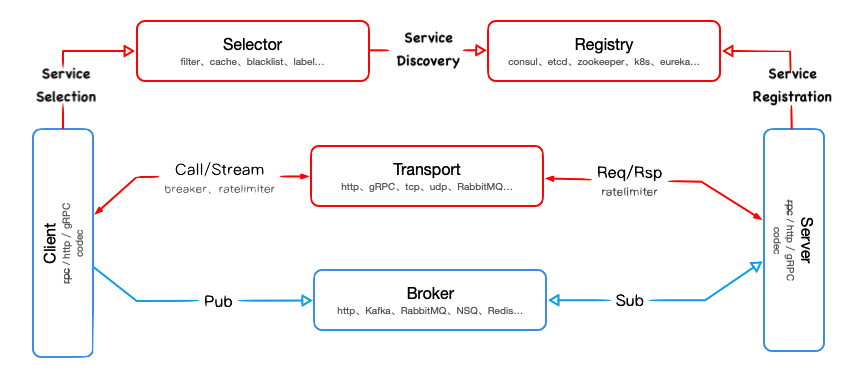

# HOWTO

- go-micro service interactions

  

- How to download all dependencies after cloning the repo?

```bash
# by default this will download all modules in go.mod
go mod download
# with golang 1.13, some modules are not compatible yet. please use this as temp solution.
go env -w GOPROXY=direct
go env -w GOSUMDB=off
go mod download
# If you are importing internal/private modules, use following setting with `go mod download`
GOPRIVATE=bitbucket.com/banzaicloud/*
go mod download
```

- How to update 3rd party dependencies?

```bash
go get -u # to use the latest minor or patch releases
go get -u=patch # to use the latest patch releases
go mod tidy
# to find out why you have specific dependency
go mod why -m github.com/DATA-DOG/go-sqlmock
# if you want to get binaries into $GOHOME/bin or $GOBIN
GO111MODULE=off go get whatever
```

- How to clean cached go modules?

```bash
rm go.sum
go clean -modcache
go mod download
# this empties $GOPATH/pkg/mod/
go clean -cache -modcache
```

- How to Prepare for a Release?

```bash
go mod tidy
go test all
```

- how to debug in VS Code?

  > every time, make sure `file with main()` is opened before proceeding to next steps

  1. open GoLang file with `main()` method you want to debug.
  2. click on debug icon in `Action Bar`
  3. click on Launch [▶] button.
  4. Optionally edit `.vscode/launch.json` and add `args`, `env` etc.

- How to implement integration tests?

Integration tests are e2e tests that invoke `Handler` methods directly and ignore networking completely.<br/>
True e2e tests are Black-box tests that invoke network endpoint.

```go
  func TestEmailService_Welcome(t *testing.T) {
    t.Parallel()
    //...
  }

  func TestEmailService_Welcome_Invalid(t *testing.T) {
      t.Parallel()
      //...
  }

  func TestEmailService_Welcome_Integration(t *testing.T) {
      if testing.Short() {
          t.Skip("skipping integration test")
      }
      //...
  }

  func TestEmailService_Welcome_E2E(t *testing.T) {
      if testing.Short() {
          t.Skip("skipping e2e test")
      }
      //...
  }
```

Notice the last test has the convention of:

- using `Integration` in the test name.
- checking if running under `-short` flag directive.

Basically, the spec goes:

> "write all tests normally. if it is a long-running tests, or an integration test, follow this naming convention and check for `-short`"

When we want to run our unit tests, we would use the -short flag, and omit it for running our integration tests or long running tests.

> Use `t.Errorf` `t.Logf` for logging. don't use `logrus` or default `log`

```bash
# Run only Unit tests:
go test -v -short
go test -v -short ./srv/emailer/service
# Run only Integration Tests: Useful for smoke testing canaries in production.
go test -v -run Integration
go test -v -run Integration ./srv/emailer/service
```

- How to ssh and debug a `scratch` container?

  > Ephemeral containers are a great way to debug running pods, as you can’t add regular containers to a pod after creation.
  > These containers executes within the namespace of an existing pod and has access to the file systems of its individual containers.

  ```bash
  kubectl debug -c debug-shell --image=busybox target-pod -- sh
  ```

- How to debug a `pod` that is crashing during initialization?
  If you `pod` crashing you cannot SSH to it, e.g., to see file system etc.
  Assuming your container has **busybox** at `/bin/busybox`, add following `command` to your deployment yaml.

  ```yaml
  # Just spin & wait forever
  command:
    [
      "/bin/busybox",
      "sh",
      "-ec",
      "while :; do echo '.'; /bin/busybox sleep 5 ; done",
    ]
  ```

  Then run `kubectl exec -it $POD_NAME -- /bin/busybox sh` to SSH to the container.

  ```bash
  /bin/busybox ls config
  /bin/busybox more config/config.yaml
  ```

- Why some ORM model fields are pointers?

  all fields having a zero value, like 0, '', false or other [zero values](https://tour.golang.org/basics/12), <br/>
  won’t be saved into the database but will use its default value.<br/>
  If you want to avoid this, consider using a pointer type or scanner/valuer, e.g:

  ```go
  // Use pointer value
  type User struct {
  gorm.Model
  Name string
  Age  *int `gorm:"default:18"`
  }

  // Use scanner/valuer
  type User struct {
  gorm.Model
  Name string
  Age  sql.NullInt64 `gorm:"default:18"`
  }
  ```

  **Note:** google wrapper types google.protobuf.StringValue, .BoolValue, .UInt32Value, .FloatValue, etc. map to <br/>
  pointers of the internal type at the ORM level, e.g. *string, *bool, *uint32, *float <br/>

- How to run `go-micro` gRPC services and `Micro` REST Gateway on k8s?

  So you want to use k8s internal `CoreDNS` as `service registry`?, then you have to follow some rules:

  - Service name cannot have `.`(dot) due to k8s DNS limits, so make it simple via environment variables e.g., `MICRO_SERVER_NAME=account`
  - custom build REST Gateway as `micro/micro:latest` image is outdated. optionally add CORS plugin.

- performance
  If you’re concerned about performance, try

  ```bash
  --selector=cache # enables in memory caching of discovered nodes
  --client_pool_size=10 # enables the client side connection pool
  ```

- How to rollback a git commit?

  ```bash
  # Undoing the Last Commit:
  git reset --soft HEAD~1
  # If you don't want to keep these changes, simply use the --hard flag.
  git reset --hard HEAD~1

  # Delete Tag local
  git tag --delete v0.1.3
  # Delete Tag remote
  git push --delete origin v0.1.3
  ```

- How to Push Git Tags with Commit?
  Refer: [how-to-push-git-tags-with-commit](https://blog.ssanj.net/posts/2018-10-30-how-to-push-git-tags-with-commit.html)

  ```bash
  git config --global push.followTags true
  ```

## Refer

- [separating-tests-in-go](https://filipnikolovski.com/separating-tests-in-go/)
- [advanced testing tips & tricks](https://medium.com/@povilasve/go-advanced-tips-tricks-a872503ac859)
